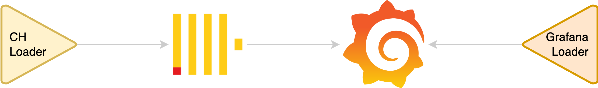

# Devcontainers Consumer Node

This project is an example of how to use DevContainers to build a consumer node that reads processed data from the project [devcontainers-etl-node](https://github.com/marcoscobo/devcontainers-etl-node). Its main purpose is to demonstrate how to develop visualization layers, analysis, or applications in a decoupled and federated environment.

## Project Purpose

The goal of this project is to provide a preconfigured development environment that facilitates the creation of applications consuming processed data from external systems. This includes:

- **Data Visualization**: Create dashboards and interactive charts using tools like Grafana.
- **Data Analysis**: Implement data analysis and transformation processes.
- **Application Development**: Build applications that interact with processed data.

The diagram below shows the interaction between the project components:

  

## Key Features

- **DevContainers**: Development container configuration to ensure a consistent environment.
- **Integration with ClickHouse**: Database for storing and querying processed data.
- **Dashboards in Grafana**: Data visualization through preconfigured dashboards.
- **Python Support**: Optimized environment for developing scripts and data analysis in Python.

## Project Structure

- `.devcontainer/`: Development container configuration.
  - `devcontainer.json`: Main DevContainer configuration.
  - `docker-compose.yml`: Docker services configuration.
- `clickhouse/`: Initialization files for the ClickHouse database.
  - `init/`: SQL scripts to define schemas and load data.
- `grafana/`: Dashboard and datasource configuration for Grafana.
  - `dashboards/`: Predefined dashboards.
  - `provisioning/`: Datasource and dashboard configuration.

## Prerequisites

- Docker and Docker Compose installed on your machine.
- Visual Studio Code with the DevContainers extension.

## Getting Started

1. Clone this repository to your local machine.
2. Open the project in Visual Studio Code.
3. Open the project in the development container (Cmd+Shift+P --> Dev Containers: Reopen in Container).
4. Access the configured services, such as ClickHouse and Grafana, to start working.

## License

This project is licensed under the terms of the MIT license.
